# 论文辅导系统项目报告

## 1. 项目概述

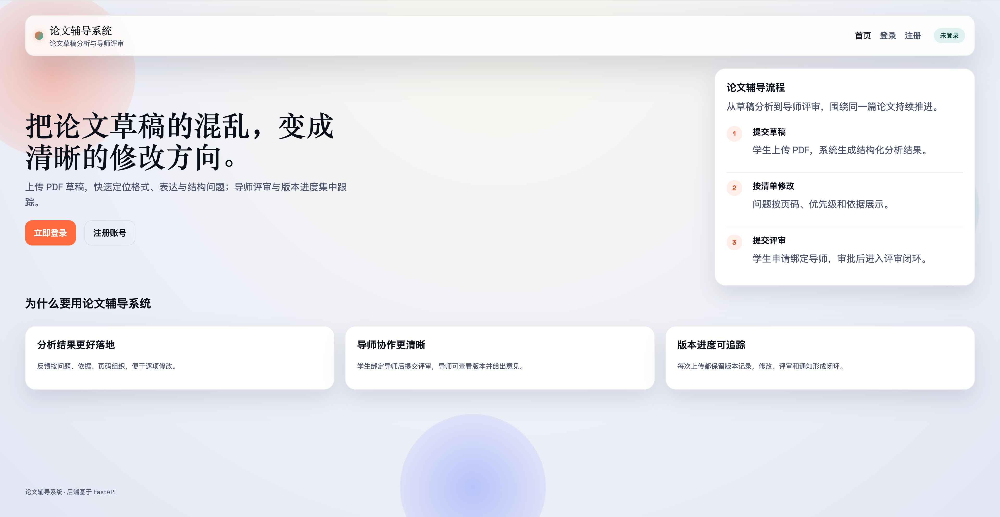

### 1.1 项目名称

论文辅导系统（Thesis Gravity）

### 1.2 项目背景

毕业论文写作通常存在两个痛点：一是学生难以及时发现论文中存在的格式、结构、表达和图表问题；二是导师在评阅过程中需要频繁往返查看不同版本，沟通成本较高。本项目围绕“论文提交、智能分析、导师评审、结果通知”四个关键环节，构建一套面向学生、导师、教务和管理员的学位论文辅导系统。

### 1.3 项目目标

- 为学生提供从论文草稿上传到结构化反馈获取的完整闭环。
- 为导师提供基于版本的评审入口与进度跟踪能力。
- 将论文分析流程模块化，便于后续扩展更多规则、模型与角色能力。
- 建立安全、可维护、可继续演进的前后端一体化系统基础。

### 1.4 项目定位

本项目不是简单的“文件上传系统”，而是一套围绕论文写作过程的教学辅助平台。它强调：

- 以论文任务为中心，而不是以单次上传为中心。
- 以版本演进为主线，而不是只保存最终结果。
- 以结构化分析结果支撑学生修改，而不是只生成泛化建议。
- 以导师评审和通知机制形成真实业务闭环。

## 2. 建设目标与需求分析

### 2.1 用户角色

系统当前设计了四类角色：

| 角色 | 主要职责 |
| --- | --- |
| 学生 | 注册登录、上传论文草稿、查看分析结果、查看通知、申请绑定导师、提交导师评审 |
| 导师 | 审批学生绑定申请、查看学生论文进度、评审最新版本、给出修改意见 |
| 教务 | 监督访问任务与论文信息 |
| 管理员 | 管理用户、任务、论文等全局数据 |

### 2.2 核心需求

结合现有需求文档和代码实现，系统本期重点解决以下问题：

1. 学生可以安全上传 PDF 论文草稿，并自动生成分析任务。
2. 系统能够基于论文规范清单，对论文进行规则校验、文本审阅和图表视觉检查。
3. 每篇论文可以持续提交新版本，保留修改历史。
4. 学生可以查看分析结果与 AI 使用统计，并在满足条件时提交导师审核。
5. 学生与导师之间支持绑定申请和审批。
6. 导师可以查看自己已绑定学生的论文最新版本，并提交通过或退回意见。
7. 评审与分析结果能够通过站内通知反馈给学生。

### 2.3 非功能要求

- 后端采用 `FastAPI`，保证接口组织清晰、开发效率高。
- 智能体工作流基于 `Agno`，便于封装多阶段分析流程。
- 本地数据统一落在 `data/` 目录，便于管理与隔离。
- 登录态通过 `HttpOnly Cookie` 维护，减少前端持久化令牌带来的风险。
- 测试必须使用 `data/test.db`，不得触碰生产/开发数据库 `data/app.db`。

## 3. 总体设计

### 3.1 系统总体架构

系统采用前后端分离的结构，前端负责页面交互，后端负责权限校验、论文管理、分析调度和数据持久化，智能分析模块通过 Agno 封装大模型能力。

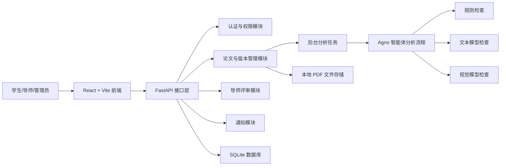

### 3.2 技术架构选型

| 层次 | 技术 |
| --- | --- |
| 前端 | React、TypeScript、Vite |
| 后端 | FastAPI、SQLAlchemy、Pydantic |
| 智能体与模型调用 | Agno、OpenAI-compatible API |
| 数据库 | SQLite |
| 依赖管理 | `uv` |
| PDF 解析 | PyMuPDF（`fitz`） |

### 3.3 项目目录结构

```text
app/
  agents/        智能体定义
  core/          配置、常量、安全逻辑
  routers/       路由与接口
  schemas/       请求响应模型
  services/      业务服务与分析逻辑
frontend/
  src/pages/     前端页面
  src/api/       前端接口封装
docs/
  requirements.md
  development.md
  project-report.md
scripts/
  lint.sh
  create_admin.py
source/
  common-problems-for-students.md
tests/
  各模块自动化测试
data/
  运行数据库与上传论文文件
```

## 4. 软件设计

### 4.1 分层设计

系统在后端采用较清晰的分层方式：

- `routers`：负责接口定义、参数接收、权限控制和响应输出。
- `services`：负责论文分析、文件处理、规则校验等业务逻辑。
- `agents`：负责封装多阶段模型调用策略。
- `schemas`：负责结构化请求与响应模型。
- `models`：负责数据库实体定义。
- `core`：负责配置、安全、日志和常量管理。

这种分层方式的优点在于接口层与业务逻辑分离明显，后续如果替换数据库、模型服务或新增任务队列，改动面相对可控。

### 4.2 权限设计

系统采用基于角色的访问控制（RBAC）：

- 学生只能访问自己的论文、任务、通知与导师申请信息。
- 导师只能查看自己已绑定学生的论文与待审版本。
- 教务与管理员具备更高范围的监督与查询能力。
- 管理员可访问额外的 `/admin/*` 管理接口。

当前后端权限校验通过依赖注入完成，核心逻辑是先解析当前用户，再按角色限制访问范围。

代码片段示例：

```python
def require_roles(*roles: str):
    def _role_dep(user: User = Depends(get_current_user)) -> User:
        if user.role not in roles:
            raise HTTPException(
                status_code=status.HTTP_403_FORBIDDEN,
                detail="Insufficient permissions",
            )
        return user
```

### 4.3 会话与认证设计

系统默认使用 `HttpOnly Cookie` 保存会话令牌，同时兼容 `Authorization: Bearer` 头，便于接口调试与自动化测试。密码存储使用 `bcrypt`，并在进入 `bcrypt` 前做一次 `SHA-256 + Base64` 归一化，以规避 bcrypt 的输入长度限制问题。

代码片段示例：

```python
def _set_session_cookie(response: Response, token: str) -> None:
    response.set_cookie(
        key=settings.session_cookie_name,
        value=token,
        httponly=True,
        secure=settings.session_cookie_secure,
        samesite=settings.session_cookie_samesite,
        max_age=settings.access_token_expire_minutes * 60,
        path="/",
    )
```

### 4.4 论文与版本模型设计

系统没有将每次上传视为独立任务，而是采用“论文任务 - 版本 - 分析任务”的三级结构：

- `Thesis`：表示一篇论文任务。
- `ThesisVersion`：表示论文的某次提交版本。
- `AnalysisTask`：表示针对某个版本发起的一次分析任务。

这种设计解决了以下问题：

- 同一篇论文可以多次修改并形成版本历史。
- 每个版本都可对应自己的分析结果。
- 导师评审始终围绕“当前最新版本”展开，避免混乱。

### 4.5 分析流程设计

系统的分析不是一次性把整篇论文丢给模型，而是分层处理：

1. 先对 PDF 按页提取文本。
2. 将论文规范文档解析为结构化检查清单。
3. 规则可判断的问题优先走规则层。
4. 需要语义判断的内容走文本模型层。
5. 图表、版式等视觉问题走视觉模型层。
6. 对长论文增加“局部页批次审阅 + 全局梗概复核”机制。
7. 汇总为结构化问题列表、检查项列表和整体结论。

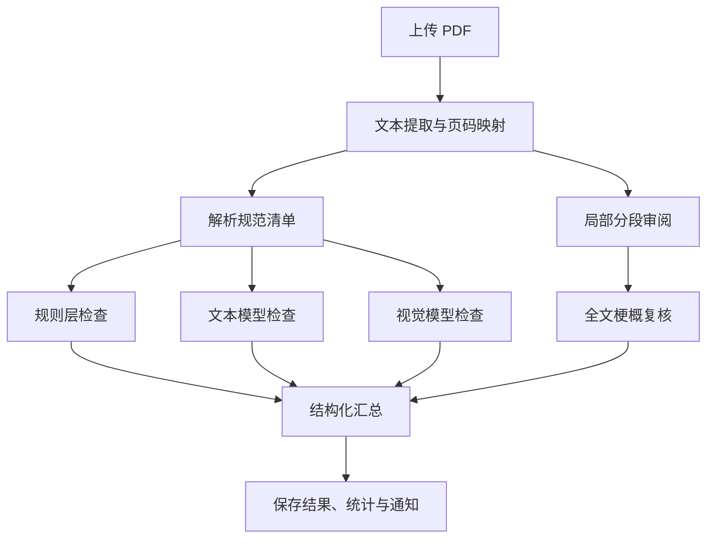

### 4.6 状态流转设计

论文状态流转体现了真实业务阶段：

| 论文状态 | 含义 |
| --- | --- |
| `analysis_pending` | 已上传，AI 正在分析 |
| `analysis_done` | 分析完成，等待学生处理并提交导师 |
| `mentor_review` | 已提交导师评审 |
| `changes_requested` | 导师要求修改 |
| `approved` | 导师已通过 |

版本状态则侧重版本本身所处阶段：

| 版本阶段 | 含义 |
| --- | --- |
| `draft` | 首次提交草稿 |
| `revision` | 修改后的版本 |
| `final` | 通过评审后的最终版本 |

## 5. 功能设计与实现

### 5.1 用户注册、登录与个人信息

系统支持学生和导师自助注册，注册信息包括邮箱、密码、角色与可选姓名。登录成功后，由服务端写入安全会话 Cookie。已登录用户可查看并更新个人信息。

已实现接口：

- `POST /auth/register`
- `POST /auth/login`
- `POST /auth/logout`
- `GET /auth/me`
- `PUT /auth/profile`

### 5.2 学生论文工作台

学生工作台是当前前端实现最完整的页面，主要提供以下能力：

- 查看个人论文任务列表。
- 查看每篇论文的版本历史。
- 上传新论文或追加新版本。
- 查看分析任务状态、分析结果与问题列表。
- 查看 AI 使用统计。
- 查看通知并标记已读。
- 忽略低风险问题。
- 在满足条件时将版本提交导师评审。

学生工作台的总览栏显示当前处理论文的概览信息。如下图所示，当前分析的论文名称为《M公司盈利能力分析及提升策略研究》，状态为“分析已完成”，并建议学生先根据问题清单继续修改论文。总览栏的右侧显示当前任务消耗的 Token 数为`711k`。

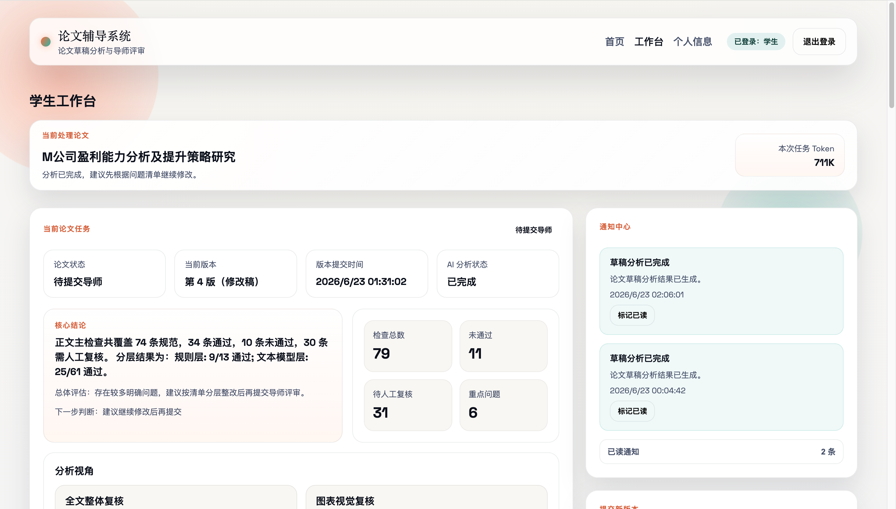

总览栏的下方是当前论文的详细信息，包含了核心结论、检查总数、检查未通过的条数、重点问题数量等信息，以及分析视角、问题与修改建议两个子卡片。

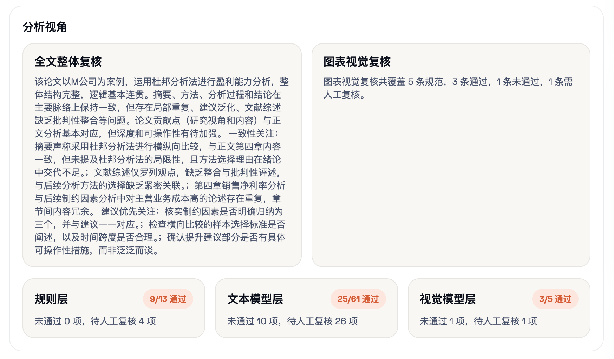

分析视角卡片中，展示了AI对全文整体分析复核的结论：“该论文以M公司为案例，运用杜邦分析法进行盈利能力分析，整体结构完整，逻辑基本连贯。摘要、方法、分析过程和结论在主要脉络上保持一致，但存在局部重复、建议泛化、文献综述缺乏批判性整合等问题。……”

该卡片还对论文中的图表进行了视觉复核，复核结果显示：“图表视觉复核共覆盖5条规范，3条通过，1条未通过，1条需人工复核。”

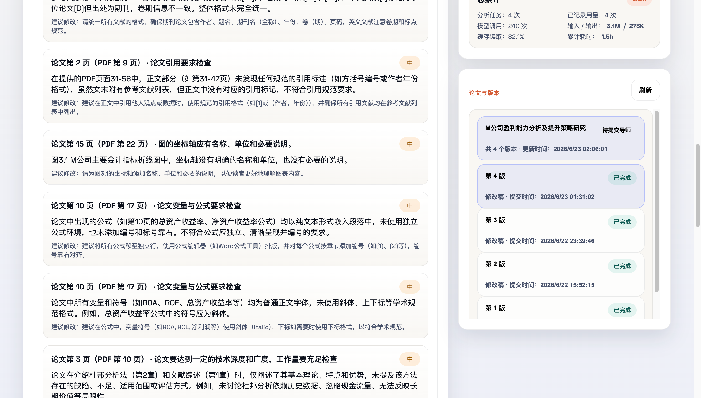

论文与版本卡片位于工作台的右侧，展示了学生提交的不同论文的多个版本及每个版本的状态。

### 5.3 PDF 上传与校验

系统目前只允许上传 PDF 文件，并在保存后立即做内容合法性校验：

- 文件后缀必须为 `.pdf`。
- PDF 必须能被正常解析。
- PDF 不能为空。
- 必须能提取到有效文本，纯图片扫描件会被拒绝。

代码片段示例：

```python
def validate_pdf_content(pdf_path: Path) -> None:
    doc = fitz.open(str(pdf_path))
    if len(doc) == 0:
        raise HTTPException(status_code=400, detail="PDF 文件为空，请检查文件内容。")

    has_meaningful_text = False
    for page in doc:
        text = page.get_text().strip()
        if text:
            has_meaningful_text = True
            break
```

上传卡片展示图：
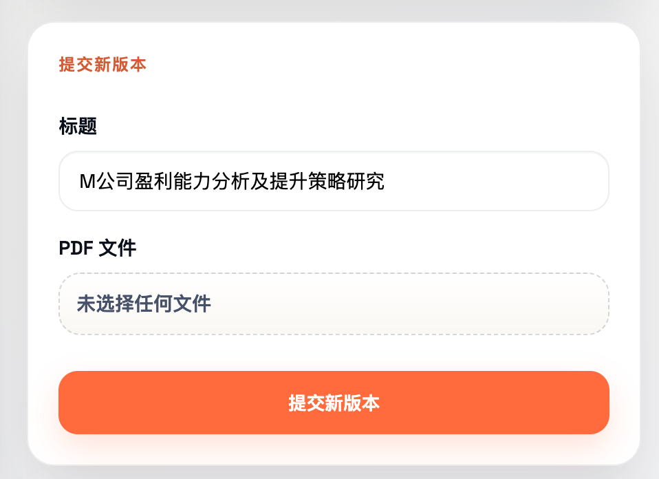

### 5.4 自动分析功能

自动分析是本项目的核心创新点之一。当前分析结果包含以下内容：

- 论文整体摘要与总体评价。
- 问题列表 `issues`。
- 检查清单逐项结论 `checks`。
- 分层统计摘要 `layer_summaries`。
- 是否达到可提交导师的建议状态 `ready_for_mentor`。
- AI 调用统计摘要 `llm_usage_summary`。

问题与修改建议卡片中，分项展示了高、中、低三种优先级的检测问题。例如“参考文献要求检查”这一项的结果显示：在论文第48页，部分英文文献缺少期刊名（如［19］）、卷期号（如［21、［31］），中文文献［标记为学位论文［D］但出处为期刊，卷期信息不一致。整体格式未完全统一。该项检查优先级评级为“中”，学生必须修正该问题后，才允许执行下一步操作（提交给导师审核）。检查项的下方，AI 还给出了该项问题的修改建议。

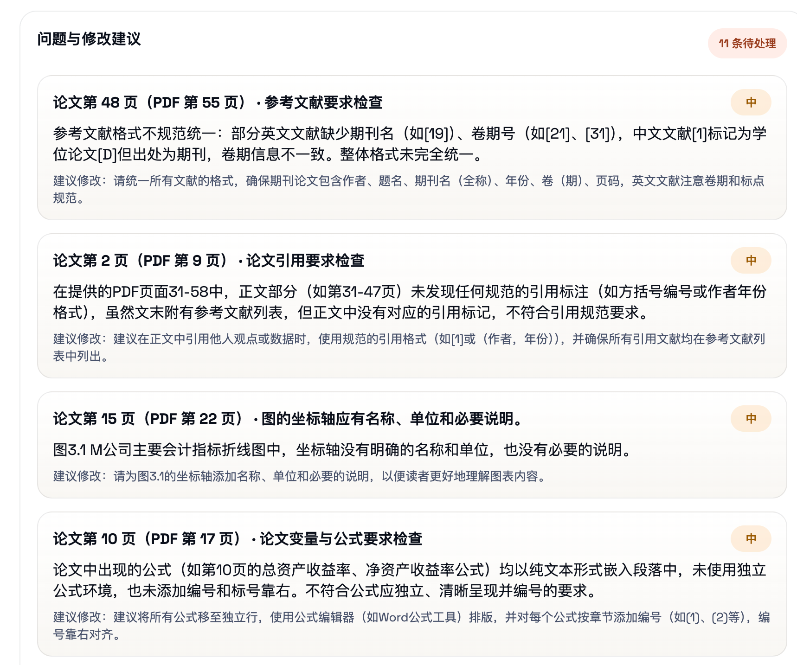

又如“论文英文术语要求检查”这一项，结果显示：在论文第10页，英文缩写 ROE 首次出现于论文第10页（PDF第17页）“净资产收益率（ROE）”时，未给出英文全称 Return on Equity；同样，ROA 首次出现于论文第11页（PDF第18页）“总资产收益率（ROA）”时也未给出全称。

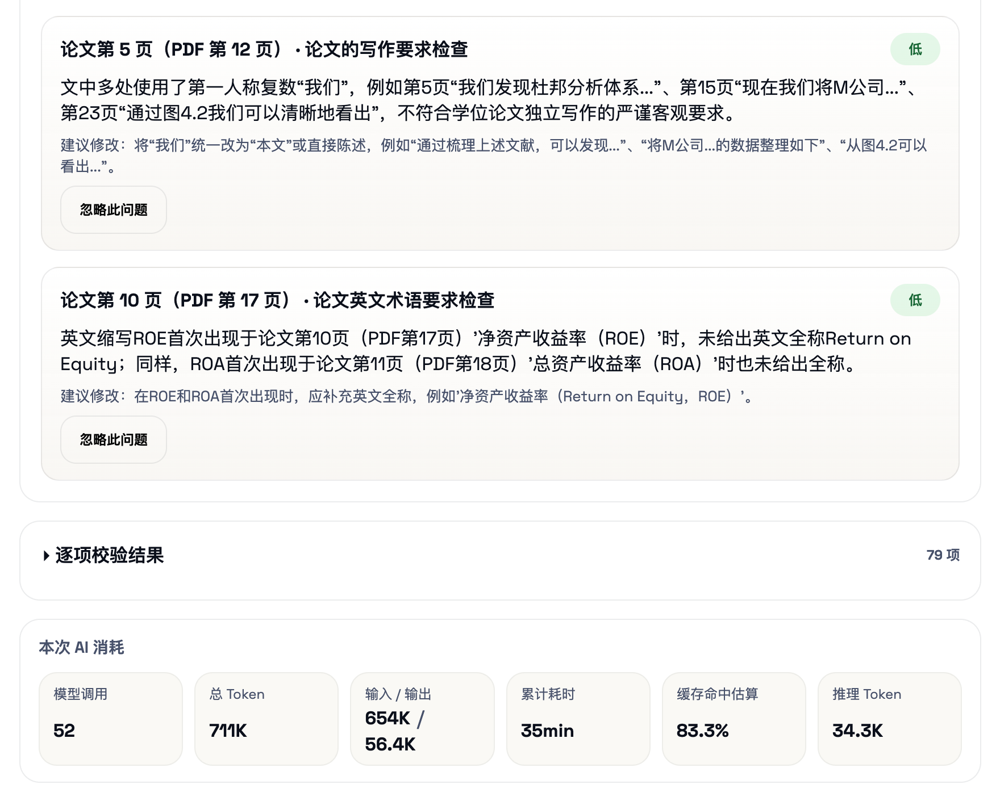

工作台的下方，还给出了逐项校验结果，默认折叠。学生可按需查看。

系统还会记录模型调用的详细日志，包括：

- 调用阶段；
- 输入输出字符数；
- token 使用情况；
- cache 命中情况；
- 调用耗时；
- 关联的检查项与页码。

这为后续的性能优化、调用分析与计费扩展提供了基础。

### 5.5 页面映射与问题定位

论文 PDF 经常包含封面、目录、摘要等前置页，导致 PDF 物理页码与论文正文页码不一致。系统在分析时会先建立“PDF 页码到论文印刷页码”的映射，分析结果优先展示论文页码，同时保留原始 PDF 页码，降低用户定位问题的成本。

### 5.6 AI 用量统计

系统已为学生提供 AI 使用统计汇总，至少包含：

- 当前月任务数；
- 历史任务数；
- 模型调用总次数；
- 输入、输出与总 token；
- cache 读写 token；
- 调用总时长；
- 成功与失败调用数。

该模块有助于后续开展资源监控、成本分析与策略优化。

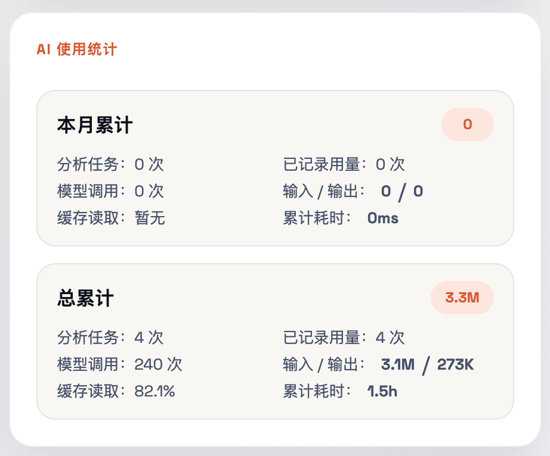

### 5.7 导师绑定与审批

为了保证导师只能查看自己负责学生的论文，系统增加了导师绑定关系：

1. 学生搜索导师并发起绑定申请。
2. 导师查看待审批申请。
3. 导师批准或拒绝。
4. 审批通过后，导师可查看对应学生的论文与版本进度。

这一设计让系统从单向分析工具扩展为协同教学平台。

### 5.8 导师评审功能

导师工作台当前已支持以下能力：

- 查看待评审版本列表。
- 查看已绑定学生列表。
- 查看论文整体进度。
- 打开版本详情，查看分析结果与历史评审。
- 在线预览原始 PDF。
- 提交评审决定：`approved` 或 `changes_requested`。

评审提交后，系统会：

- 更新论文状态；
- 更新当前版本阶段；
- 生成站内通知推送给学生。

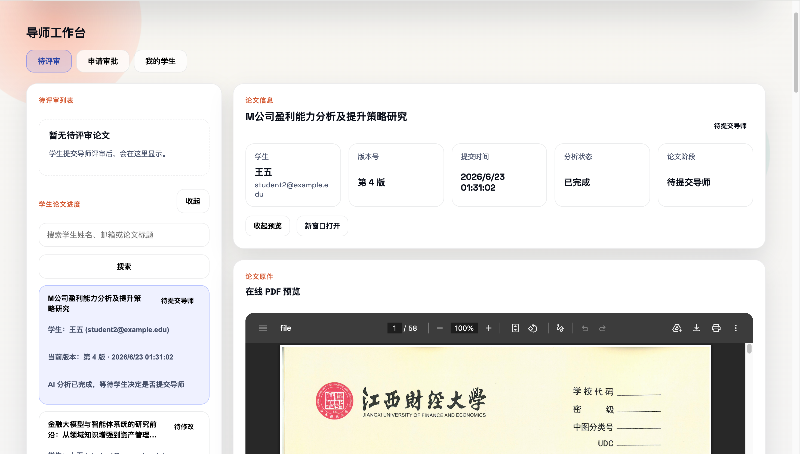

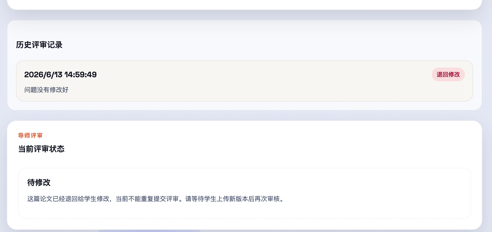

### 5.9 通知功能

系统提供站内通知机制，主要用于：

- 分析成功后通知学生；
- 导师评审后通知学生；
- 支持未读筛选与已读标记。

通知系统虽然简单，但在业务闭环中作用明显，可以把论文写作过程中的关键事件显式化。

### 5.10 管理端能力

后端已实现一组 `/admin/*` 接口，管理员可以：

- 查看用户列表与详情；
- 查看任务列表与详情；
- 修改任务状态；
- 删除非管理员用户；
- 查询论文与版本。

当前前端尚未实现管理员专属界面，因此该部分主要通过接口和 API 文档使用。

## 6. 数据库设计

### 6.1 核心实体

系统数据库当前主要包含以下实体：

- `User`
- `Thesis`
- `ThesisVersion`
- `AnalysisTask`
- `AnalysisLLMCallLog`
- `Notification`
- `MentorReview`
- `MentorRelation`

### 6.2 实体关系图

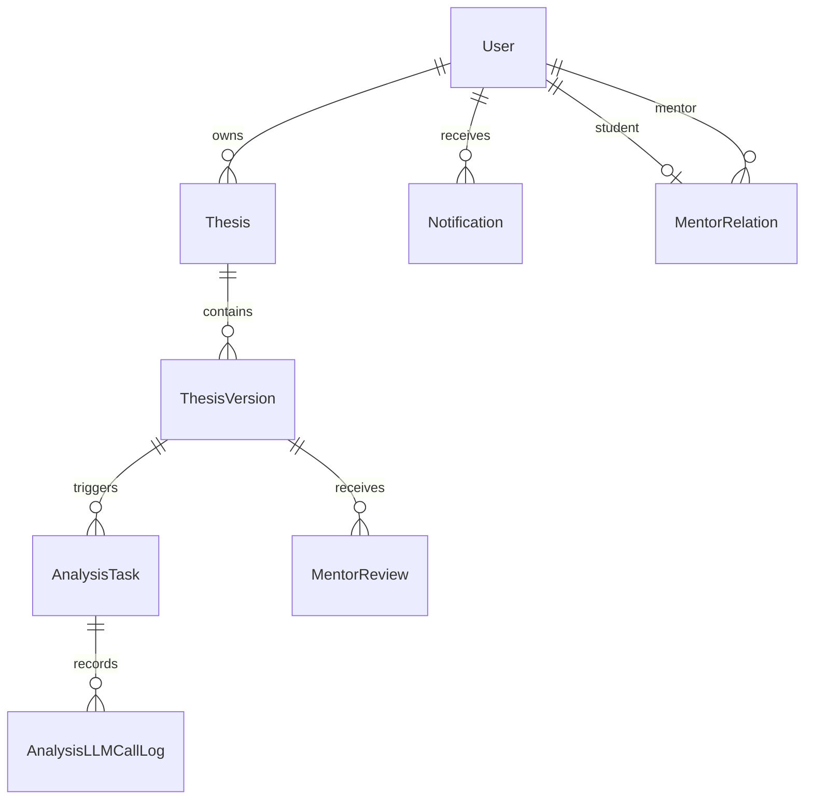

### 6.3 关键数据表说明

| 数据表 | 作用 |
| --- | --- |
| `users` | 存储用户账号、角色、密码哈希、创建时间等 |
| `theses` | 存储论文任务主记录 |
| `thesis_versions` | 存储论文版本信息与文件路径 |
| `analysis_tasks` | 存储每次版本分析任务的状态、结果与摘要 |
| `analysis_llm_call_logs` | 存储模型调用明细日志 |
| `mentor_reviews` | 存储导师评审结果与意见 |
| `mentor_relations` | 存储导师与学生绑定关系 |
| `notifications` | 存储站内通知 |

### 6.4 数据安全设计

本项目对数据库操作有明确约束：

- 开发数据库默认是 `data/app.db`。
- 自动化测试数据库固定为 `data/test.db`。
- 严禁对 `data/app.db` 执行破坏性操作。
- 上传文件与运行数据均放在 `data/` 下，方便隔离管理。

## 7. 接口设计

### 7.1 主要接口清单

| 模块 | 方法 | 路径 | 说明 |
| --- | --- | --- | --- |
| 认证 | `POST` | `/auth/register` | 注册 |
| 认证 | `POST` | `/auth/login` | 登录并写入会话 Cookie |
| 认证 | `POST` | `/auth/logout` | 退出登录 |
| 认证 | `GET` | `/auth/me` | 获取当前用户 |
| 认证 | `PUT` | `/auth/profile` | 修改个人信息 |
| 论文 | `GET` | `/theses` | 获取学生论文工作台数据 |
| 论文 | `POST` | `/theses/drafts` | 上传新论文或追加新版本 |
| 论文 | `GET` | `/theses/usage-stats` | 获取 AI 使用统计 |
| 论文 | `GET` | `/theses/versions/{version_id}/file` | 预览指定版本 PDF |
| 任务 | `GET` | `/tasks` | 获取任务列表 |
| 任务 | `GET` | `/tasks/{task_id}` | 获取任务详情 |
| 任务 | `POST` | `/tasks/{task_id}/submit-for-mentor` | 提交导师评审 |
| 任务 | `POST` | `/tasks/{task_id}/issues/{issue_key}/ignore` | 忽略某个问题 |
| 通知 | `GET` | `/notifications` | 获取通知列表 |
| 通知 | `POST` | `/notifications/{id}/read` | 标记通知已读 |
| 导师 | `GET` | `/mentor/list` | 学生搜索导师 |
| 导师 | `POST` | `/mentor/applications` | 学生提交导师申请 |
| 导师 | `GET` | `/mentor/my-application` | 学生查看自己的申请 |
| 导师 | `GET` | `/mentor/applications` | 导师查看待审批申请 |
| 导师 | `POST` | `/mentor/applications/{application_id}/approve` | 导师批准申请 |
| 导师 | `POST` | `/mentor/applications/{application_id}/reject` | 导师拒绝申请 |
| 导师 | `GET` | `/mentor/students` | 导师查看已绑定学生 |
| 导师 | `GET` | `/mentor/pending-reviews` | 导师查看待评审版本 |
| 导师 | `GET` | `/mentor/theses` | 导师查看论文进度 |
| 导师 | `GET` | `/mentor/versions/{version_id}` | 查看版本详情 |
| 导师 | `GET` | `/mentor/reviews/{version_id}` | 查看评审历史 |
| 导师 | `POST` | `/mentor/reviews` | 提交评审结果 |
| 管理 | `GET` | `/admin/users` 等 | 管理员管理用户、任务和论文 |

### 7.2 接口风格

系统接口整体遵循 REST 风格，具有以下特点：

- 路径按业务模块组织；
- 使用 Pydantic 进行请求和响应建模；
- 鉴权失败、权限不足、资源不存在等情况返回明确状态码；
- 开发环境可通过 OpenAPI 页面直接调试。

## 8. 前端设计

### 8.1 页面组成

当前前端页面主要包括：

- 首页 `Home`
- 登录页 `Login`
- 注册页 `Register`
- 个人信息页 `Profile`
- 工作台入口页 `Workspace`
- 学生工作台 `Student`
- 导师工作台 `Mentor`
- 404 页面 `NotFound`

### 8.2 前端交互特点

- 登录成功后跳转工作台。
- 工作台按角色切换学生或导师视图。
- 学生分析中的任务会自动轮询刷新。
- 导师端会定时刷新待评审列表、申请列表和学生列表。
- 前端通过统一的 `apiFetch` / `apiForm` 调用后端接口。

### 8.3 页面设计说明

当前前端重点强调业务流程可用性，而不是复杂视觉设计。其优势在于：

- 能够直观验证后端流程是否闭环；
- 方便开展接口联调与功能验收；
- 为后续优化 UI 和补充管理员、教务前端打下基础。

## 9. 核心业务流程

### 9.1 学生论文提交与分析流程

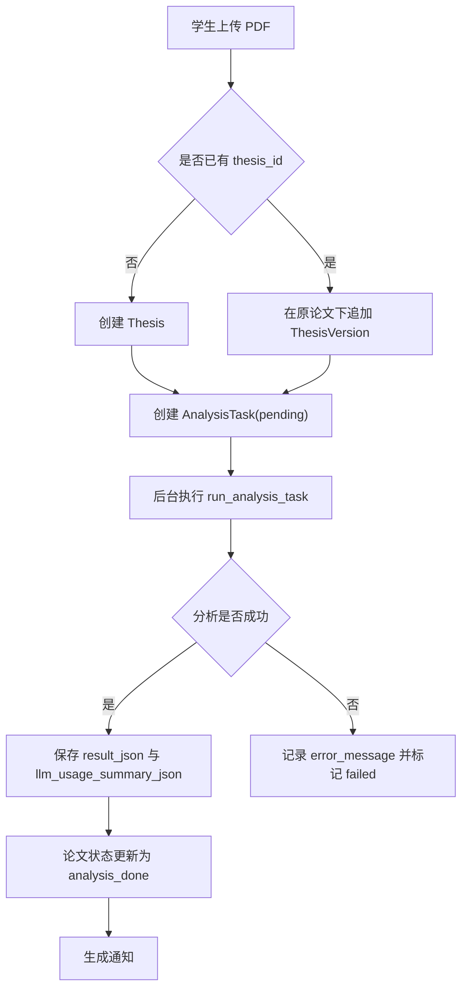

### 9.2 学生提交导师评审流程

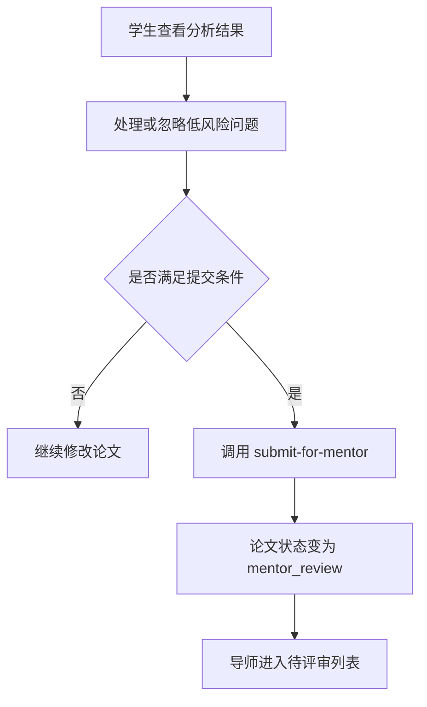

### 9.3 导师评审流程

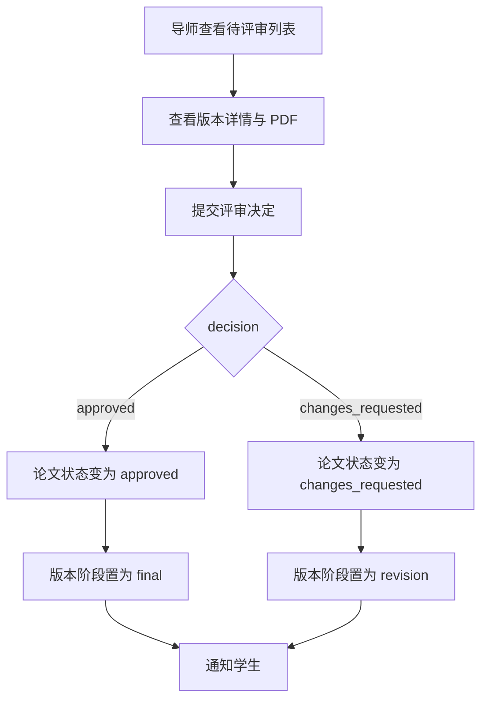

## 10. 开发与运行说明

### 10.1 环境要求

- Python 3.12+
- Node.js 18+
- `uv`

### 10.2 依赖安装

后端依赖安装：

```bash
uv sync --all-groups
```

前端依赖安装：

```bash
cd frontend
npm install
```

### 10.3 环境变量

项目支持通过 `.env` 文件配置，至少应关注以下项目：

- `JWT_SECRET_KEY`
- `DATABASE_URL`
- `LLM_PROVIDER`
- `LLM_MODEL_ID`
- `LLM_API_KEY`
- `LLM_BASE_URL`
- `VISION_LLM_MODEL_ID`
- `VISION_LLM_API_KEY`
- `VISION_LLM_BASE_URL`
- `REFERENCE_DOC_PATH`
- `CORS_ORIGINS`

### 10.4 启动方式

开发模式：

```bash
./start.sh
```

生产模式：

```bash
./start.sh prod
```

开发模式访问地址：

- 前端：`http://localhost:5173`
- 后端：`http://127.0.0.1:8000`
- OpenAPI：`http://127.0.0.1:8000/docs`

生产模式访问地址：`http://127.0.0.1:8000`

### 10.5 代码检查

```bash
./scripts/lint.sh --all
```

### 10.6 本地数据管理

- 数据库默认位于 `data/app.db`
- 测试数据库位于 `data/test.db`
- 上传论文默认位于 `data/theses/{student_id}/`
- 禁止自动删除 `data/` 下任何内容

## 11. 使用说明

### 11.1 学生使用流程

1. 注册学生账号并登录系统。
2. 进入学生工作台，上传论文 PDF。
3. 等待系统完成自动分析。
4. 查看分析结果、问题列表和 AI 使用统计。
5. 在个人信息页申请绑定导师。
6. 绑定审批通过后，将当前版本提交导师评审。
7. 查看导师反馈，若被退回则修改后重新上传版本。

### 11.2 导师使用流程

1. 注册导师账号并登录系统。
2. 在申请列表中审批学生绑定请求。
3. 在待评审列表中查看学生提交的最新版本。
4. 预览 PDF、查看分析结果和历史记录。
5. 提交“通过”或“退回修改”的评审意见。

### 11.3 管理员使用流程

1. 通过接口或 API 文档访问管理功能。
2. 查询用户、任务、论文及版本。
3. 在必要时进行运维级管理操作。

## 12. 测试与质量保证

### 12.1 已有测试覆盖

项目已包含多组自动化测试，覆盖范围包括：

- 论文工作流；
- 导师申请与评审；
- 规则分析；
- 图表抽取；
- 页码映射；
- 管理接口。

相关测试文件包括：

- `tests/test_theses_workflow.py`
- `tests/test_mentor.py`
- `tests/test_analysis_rules.py`
- `tests/test_analysis_workflow_pdf.py`
- `tests/test_analysis_page_mapping.py`
- `tests/test_analysis_checklist.py`
- `tests/test_admin.py`

### 12.2 测试隔离设计

测试通过 `tests/conftest.py` 强制将 `DATABASE_URL` 指向 `data/test.db`，从机制上避免自动化测试误操作开发数据库。这是本项目在数据安全上的一个重要设计点。

代码片段示例：

```python
TEST_DB_PATH = Path(__file__).resolve().parent.parent / "data" / "test.db"
os.environ["DATABASE_URL"] = f"sqlite:///{TEST_DB_PATH}"
```

### 12.3 当前质量特点

从现有代码看，项目已经具备较好的工程化意识：

- 接口、模型、服务分层较清晰；
- 测试数据库隔离明确；
- 关键流程已有自动化验证；
- 文档与代码基本保持同步。

## 13. 项目特色与创新点

### 13.1 以论文任务为中心的版本化设计

系统把同一篇论文视为一个持续演化的对象，而不是把每次上传视为一次独立任务，更贴合真实论文写作过程。

### 13.2 分层分析机制

系统并未简单依赖单次大模型调用，而是将分析拆分为规则层、文本模型层和视觉模型层，提高了准确性与可解释性。

### 13.3 论文页码映射

分析结果优先展示论文印刷页码，同时保留 PDF 页码，提升问题定位效率。

### 13.4 AI 调用可观测性

系统不仅输出分析结果，还记录调用次数、token、cache 命中和耗时，为后续成本管理与性能优化打下基础。

### 13.5 导师协同闭环

学生申请导师、导师审批、导师评审、学生接收通知等能力，使系统从“智能分析工具”升级为“论文辅导协同平台”。

## 14. 结论

论文辅导系统已经完成了从需求到原型实现的关键闭环，具备学生上传论文、系统自动分析、导师审批与评审、通知反馈和使用统计等核心能力。系统整体设计较符合真实论文指导场景，既考虑了业务流程和 AI 分析工作流，也兼顾了工程实现与数据安全。

## 附录

- 本项目 `github` 地址为：[thesis-gravity](https://github.com/James-Leong/thesis-gravity)
- AI 工作流框架 `agno` 的官方文档地址为： [Agno](https://www.agno.com/)
