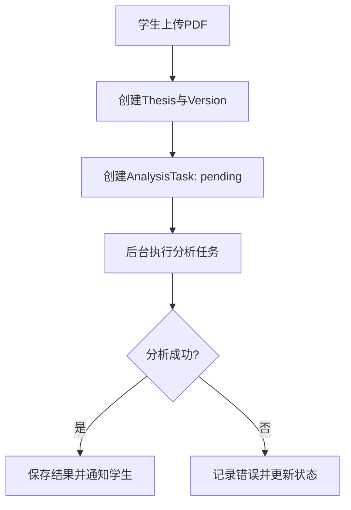
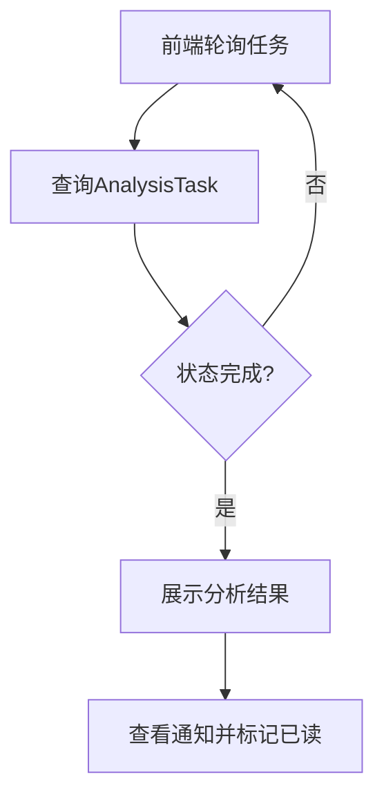
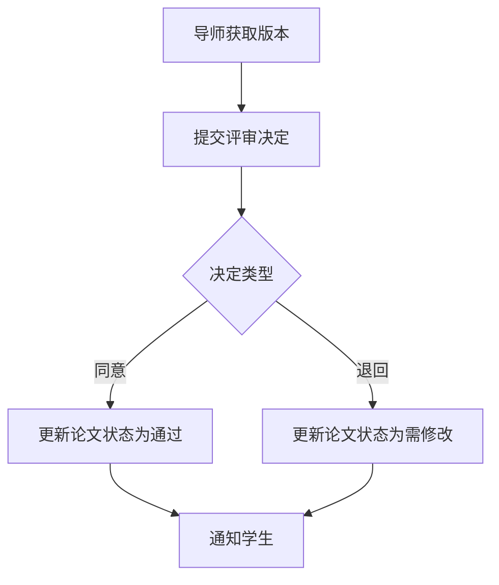

# 论文辅导系统需求文档

## 1. 背景
本项目为学位论文辅导系统，帮助学生提升论文质量，帮助导师高效完成审阅。

## 2. 目标
- 建立学生从提交草稿到获得分析反馈的完整流程。
- 建立导师评审与反馈闭环。
- 提供安全、可扩展的后端接口，便于后续前端对接。

## 3. 角色与权限
- 学生：提交草稿、查看分析结果与通知。
- 导师：对草稿版本进行评审与意见反馈。
- 教务：对任务与分析结果有监督访问权限。
- 管理员：系统全量管理权限。

## 4. 范围
### 4.1 本期范围
- 账号注册/登录与基于 `HttpOnly Cookie` 的会话认证。
- 草稿上传与存储（仅 PDF）。
- Agno 自动分析与结构化结果输出。
- 后台任务执行与任务状态查询。
- 通知系统（站内通知）。
- 导师评审与状态流转。

### 4.2 非本期范围
- 前端 UI 实现。
- 队列/分布式任务系统。
- 计费与支付。
- 除邮件以外的外部集成。

## 5. 功能需求清单（更细化）
### 5.1 认证与权限
- [ ] 注册：邮箱、密码、角色三要素校验。
- [ ] 登录：服务端设置 `HttpOnly` 会话 Cookie，包含过期时间。
- [ ] 密码：bcrypt 加密存储。
- [ ] 访问控制：基于角色的接口访问限制。
- [ ] 鉴权失败与权限不足返回明确错误码。

### 5.2 草稿提交
- [ ] 上传表单包含标题与 PDF 文件。
- [ ] 文件扩展名仅允许 .pdf。
- [ ] 存储路径为 data/theses/{student_id}/。
- [ ] 文件名使用 UUID，避免重名。
- [ ] 创建 Thesis、ThesisVersion 与 AnalysisTask 记录。
- [ ] 版本初始状态与分析任务状态正确初始化。

### 5.3 自动分析
- [ ] 按页提取 PDF 文本。
- [ ] 引用参考文档拼接到提示词。
- [ ] 调用 Agno Agent 生成结构化输出。
- [ ] 任务状态变迁：pending -> running -> completed/failed。
- [ ] 结果持久化至 AnalysisTask.result_json。
- [ ] 成功时生成通知给学生。
- [ ] 失败时记录错误信息。

### 5.4 任务状态查询
- [ ] 任务查询返回当前状态与结果。
- [ ] 学生只能访问自己的任务。
- [ ] 导师、教务、管理员可访问更广范围任务。

### 5.5 通知
- [ ] 获取当前用户通知列表。
- [ ] 支持仅查看未读通知过滤。
- [ ] 标记通知为已读。

### 5.6 导师评审
- [ ] 导师提交评审（同意/退回修改）。
- [ ] 评审包含评论与时间戳。
- [ ] 更新论文状态与版本状态。
- [ ] 评审后生成通知给学生。
- [ ] 可查询某版本的评审记录。

### 5.7 接口清单（摘要）
- [ ] /auth/register
- [ ] /auth/login
- [ ] /auth/logout
- [ ] /auth/me
- [ ] /theses/drafts
- [ ] /tasks/{task_id}
- [ ] /notifications
- [ ] /notifications/{id}/read
- [ ] /mentor/reviews
- [ ] /mentor/reviews/{version_id}

## 6. 流程图
### 6.1 草稿提交与分析

### 6.2 任务轮询与通知

### 6.3 导师评审

## 7. 数据与存储
- SQLite: data/app.db。
- ORM 模型：User、Thesis、ThesisVersion、AnalysisTask、Notification、MentorReview。
- 文件存储：data/theses/{student_id}/。

## 8. 非功能需求
- Python 3.12+。
- FastAPI 作为 API 服务。
- Agno 作为大模型调用框架。
- 统一错误处理与 HTTP 状态码。
- 使用绝对导入，保持模块清晰。

## 9. 配置项
- DATABASE_URL
- JWT_SECRET_KEY
- LLM_PROVIDER
- LLM_MODEL_ID
- LLM_API_KEY
- LLM_BASE_URL
- REFERENCE_DOC_PATH
- CORS_ORIGINS

## 10. 后续计划
- 参考文档 PDF 转 Markdown 并接入多参考资料。
- SMTP 邮件通知。
- 前端实现与端到端测试。

## 11. 里程碑
- M1: 核心后端（认证、提交、分析、通知）。
- M2: 导师评审与状态流转。
- M3: 邮件与参考文档管道。
- M4: 前端与端到端联调。
